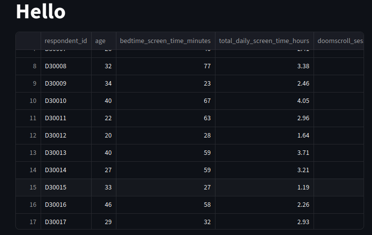

<div align="center">

# 😴 Sleep & Doomscrolling Analytics

**Интерактивное веб-приложение для анализа привычек сна и думскроллинга**

[](https://www.python.org/)
[](https://streamlit.io/)
[](https://scikit-learn.org/)
[](https://pandas.pydata.org/)
[](https://opensource.org/licenses/MIT)

[Возможности](#-возможности) •
[Быстрый старт](#-быстрый-старт) •
[Структура](#-структура-проекта) •
[Тесты](#-тестирование) •
[Roadmap](#-roadmap)

</div>

---

## 📖 О проекте

**Sleep & Doomscrolling Analytics** — это pet-проект, демонстрирующий полный цикл работы с данными: от загрузки CSV до интерактивного ML-приложения.

- 📥 Загрузка и предобработка CSV-датасета
- 📊 Визуализация пользовательской аналитики (пол, возраст, регион, род занятий)
- 🤖 Обучение моделей **регрессии** (предсказание часов сна) и **классификации** (является ли пользователь думскроллером)
- 🧪 Покрытие ключевой логики unit-тестами (pytest)
- 🎯 Интерактивный тест **«Ты думскроллер?»** на основе обученной модели

> **Датасет:** [Sleep and Doomscrolling Habits Dataset](https://www.kaggle.com/datasets/harpartapsingh13/sleep-and-doomscrolling-habits-dataset) (Kaggle)

---

## 🚀 Быстрый старт

### 1. Клонировать репозиторий

```bash
git clone https://github.com/your-username/sleep-doomscrolling-analytics.git
cd sleep-doomscrolling-analytics
```

### 2. Установить окружение одной командой

```bash
chmod +x install.sh
./install.sh
```

Скрипт `install.sh` автоматически:

1. ✅ Проверит наличие Python 3.10+
2. 📦 Создаст виртуальное окружение `SleepVenv`
3. 🔌 Активирует его
4. ⬆️ Обновит `pip`
5. 📥 Установит зависимости из `requirements.txt`

### 3. Запустить приложение

```bash
./start.sh
```

Или вручную:

```bash
source SleepVenv/bin/activate
streamlit run main.py
```

Открой в браузере 👉 **[http://localhost:8501](http://localhost:8501)**

### 4. Запустить тесты

```bash
source SleepVenv/bin/activate
pytest tests/ -v
```

С покрытием:

```bash
pytest tests/ --cov=src --cov=app --cov-report=term-missing
```

---

## 🛠 Стек технологий

| Категория | Технологии |
|-----------|-----------|
| **Язык** | Python 3.12 |
| **ML** | scikit-learn (LinearRegression, Ridge, Lasso, RandomForest, GradientBoosting, LogisticRegression, HistGradientBoosting) |
| **Данные** | pandas, numpy |
| **Визуализация** | matplotlib, seaborn |
| **UI** | Streamlit |
| **Сериализация** | joblib |
| **Тесты** | pytest, pytest-cov |

---

## 📁 Структура проекта

```
Sleep/
├── app/                        # Streamlit UI
│   ├── __init__.py
│   └── ui.py                   # WindowApp — рендеринг вкладок, тест «Ты думскроллер?»
│
├── data/                       # Датасет
│   └── sleep_doomscrolling_habits.csv
│
├── models/                     # Кэш обученных моделей (.pkl)
│   └── (генерируется автоматически)
│
├── src/                        # Бизнес-логика
│   ├── __init__.py
│   ├── data_loader.py          # Loader — загрузка, очистка, кодирование
│   ├── models.py               # ModelTrainer — обучение и кэширование
│   └── visualization.py        # Graph — графики (matplotlib/seaborn)
│
├── templates/                  # NamedTuple-модели результатов
│   ├── __init__.py
│   └── return_data.py          # RegressionResults, ClassifierResults
│
├── tests/                      # Unit-тесты
│   ├── __init__.py
│   ├── conftest.py             # Фикстуры
│   ├── test_data_loader.py
│   ├── test_models.py
│   └── test_visualization.py
│
├── notebooks/
│   └── exploration.ipynb       # EDA и эксперименты
│
├── main.py                     # Точка входа
├── requirements.txt            # Зависимости
├── install.sh                  # Скрипт установки окружения
├── start.sh                    # Скрипт запуска приложения
├── pytest.ini                  # Конфигурация pytest
└── README.md
```

---

## 🎯 Возможности

### 📊 Вкладка «User Analytics»

- Распределение пользователей по полу
- Возрастная аналитика
- Распределение по роду занятий
- География (страны/регионы)

### 📈 Вкладка «Regression»

Обучение и сравнение **5 моделей регрессии** для предсказания `sleep_hours_per_night`:

| Модель | Описание |
|--------|----------|
| 📈 Linear Regression | Базовая линейная модель |
| 🛡️ Ridge | L2-регуляризация |
| 🎯 Lasso | L1-регуляризация |
| 🌲 Random Forest | Ансамбль деревьев |
| ⚡ Gradient Boosting | Градиентный бустинг |

Для каждой модели выводится:

- Коэффициенты / важности признаков
- MAE, MSE, R²
- График «предсказание vs реальность»

### 🎯 Вкладка «Classifier»

Обучение и сравнение **3 моделей классификации** для предсказания `doomscroller`:

| Модель | Описание |
|--------|----------|
| 📉 Logistic Regression | Линейный классификатор |
| 🌲 Random Forest | Ансамбль деревьев |
| ⚡ HistGradientBoosting | Быстрый градиентный бустинг |

Для каждой модели выводится:

- Accuracy
- Classification report (precision, recall, f1-score)
- Confusion matrix (heatmap)
- Важности признаков

### 🧪 Вкладка «Ты думскроллер?»

Интерактивная форма, где вы вводите свои привычки (возраст, экранное время, количество проверок телефона и т.д.), а модель предсказывает, являетесь ли вы думскроллером.

---

## 🔧 Скрипты

| Файл | Назначение |
|------|-----------|
| 🛠️ `install.sh` | Создаёт venv и устанавливает зависимости |
| 🚀 `start.sh` | Активирует venv и запускает Streamlit |
| 📋 `requirements.txt` | Список зависимостей проекта |
| ⚙️ `pytest.ini` | Конфигурация pytest |

### `install.sh`

```bash
#!/bin/bash
set -e

VENV_DIR="SleepVenv"
PYTHON=${PYTHON:-python3}

if ! command -v "$PYTHON" &> /dev/null; then
    echo "❌ Python не найден. Установи Python 3.10+."
    exit 1
fi

if [ ! -d "$VENV_DIR" ]; then
    "$PYTHON" -m venv "$VENV_DIR"
fi

source "$VENV_DIR/bin/activate"
pip install --upgrade pip
pip install -r requirements.txt

echo "✅ Готово. Активируй: source $VENV_DIR/bin/activate"
```

### `start.sh`

```bash
#!/bin/bash
source SleepVenv/bin/activate
streamlit run main.py --server.headless true
```

---

## 🧪 Тестирование

```bash
pytest tests/ -v
```

С покрытием:

```bash
pytest tests/ --cov=src --cov=app --cov-report=term-missing
```

Пример вывода:

```
tests/test_data_loader.py ................ [ 19%]
tests/test_models.py .................... [ 87%]
tests/test_visualization.py ............. [100%]

---------- coverage ----------
Name                   Stmts   Miss  Cover
------------------------------------------
src/data_loader.py        26      0   100%
src/models.py             97     19    80%
src/visualization.py      66     12    82%
------------------------------------------
TOTAL                    296    138    53%
```

---

## 🐳 Docker (опционально)

Если хочешь запустить в контейнере:

```dockerfile
FROM python:3.12-slim
WORKDIR /app
COPY requirements.txt .
RUN pip install --no-cache-dir -r requirements.txt
COPY . .
CMD ["streamlit", "run", "main.py", "--server.headless", "true", "--server.port=8501", "--server.address=0.0.0.0"]
```

Сборка и запуск:

```bash
docker build -t sleep-analytics .
docker run -p 8501:8501 sleep-analytics
```

---

## 📸 Скриншоты



---

## 📚 Lessons Learned

В процессе разработки были найдены и исправлены классические ошибки ML-пайплайнов:

### 1. `ValueError: could not convert string to float: 'No'`

**Причина:** категориальные признаки (`Yes`/`No`) не были закодированы перед подачей в `LogisticRegression`.

**Решение:** применять `pd.get_dummies` на уровне `Loader`, а не внутри модели.

### 2. `ValueError: The least populated classes in y have only 1 member`

**Причина:** в тестовой фикстуре для классификации использовался непрерывный target вместо бинарного.

**Решение:** генерировать `np.random.choice(['Yes', 'No'], n)` в `conftest.py`.

### 3. Дублирование `get_dummies`

**Причина:** `train_linear` и `train_classifier` вызывались с уже закодированными данными, но `train_linear` делал кодирование повторно.

**Решение:** вынести препроцессинг на уровень `main.py`.

> 📓 Подробнее — в `notebooks/exploration.ipynb`

---

## 🗺 Roadmap

- [x] Базовая структура проекта
- [x] Загрузка и предобработка данных
- [x] Регрессия (5 моделей)
- [x] Классификация (3 модели)
- [x] Кэширование моделей и результатов
- [x] Интерактивный тест «Ты думскроллер?»
- [x] Unit-тесты (pytest)
- [x] `install.sh` для автоматизации setup
- [ ] CI через GitHub Actions
- [ ] Docker-образ
- [ ] Feature engineering (`screen_time_ratio`, `doomscroll_total`)
- [ ] Деплой на Streamlit Cloud
- [ ] MLflow для трекинга экспериментов

---


## 📄 Лицензия

Распространяется под лицензией **MIT**. См. `LICENSE` для деталей.

---

<div align="center">

## 👤 Автор

**Сергей** — [@Darks0l4s](https://github.com/Darks0l4s)

Проект создан как pet-проект для портфолио. Буду рад фидбеку! ⭐

---

## ⭐ Благодарности

[Kaggle](https://www.kaggle.com/) • [Streamlit](https://streamlit.io/) • [scikit-learn](https://scikit-learn.org/)

---

**Если проект был полезен — поставь ⭐ на GitHub!**

</div>